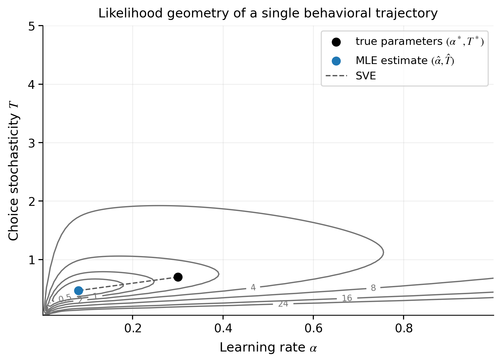

<div align="center">

# When Interpretable Parameters Fail to Explain

### A reproducible Rescorla-Wagner identifiability walkthrough for ICCCI 2026 


**Companion repository for the ICCCI 2026 paper**  
*When Interpretable Parameters Fail to Explain: Evidence from the Rescorla-Wagner Model*

**Authors:** Jarosław Drapała · Mateusz Zolisz · Paweł Wachel

</div>

---

## Overview

This repository studies **practical identifiability**, **parameter recovery**, and the limits of parameter-based explanation in a minimal two-parameter Rescorla-Wagner model.

The central question is whether fitted values of the learning rate \(\alpha\) and choice stochasticity \(T\) are sufficiently constrained by finite behavioral data to support reliable mechanistic interpretation.

> **Main message:** interpretable parameter labels do not guarantee uniquely interpretable fitted parameters. Different combinations of \(\alpha\) and \(T\) can explain the same choice-outcome sequence almost equally well.

The repository is intentionally **notebook-centered**. The notebook is the primary research artifact: it presents the model, numerical implementation, simulations, estimation procedure, diagnostics, and interpretation in the order in which they are needed.

<p align="center">
  
</p>

<p align="center"><em>Example likelihood geometry: broad near-optimal regions allow displaced parameter estimates with similar fit quality.</em></p>

## What the notebook covers

The walkthrough develops the analysis step by step:

- numerically stable sigmoid and log-likelihood calculations;
- the Rescorla-Wagner value-update rule and stochastic choice rule;
- simulation of a single choice-outcome trajectory;
- conditional log-likelihood and bounded maximum-likelihood estimation;
- likelihood geometry and practical identifiability;
- repeated simulations, boundary hits, and scaled vector error (SVE);
- recovery as a function of trajectory length;
- classical random-draw parameter recovery;
- grid-based recovery maps across the generating parameter space;
- overlap between recovered parameter distributions from distinct regimes;
- an auxiliary classification-based separability analysis.

## Diagnostic workflow

The analyses combine complementary views of the same identification problem:

1. **Likelihood geometry** — is the optimum well localized, or do extended near-optimal regions exist?
2. **Problematic estimates** — how often are fitted parameters pushed toward imposed bounds?
3. **Parameter recovery** — how close are recovered parameters to the values that generated the data?
4. **Regional diagnostics** — does recovery quality vary across the parameter space?
5. **Recovered-distribution overlap** — can distinct generating mechanisms remain distinguishable after fitting?

These diagnostics are intended to support scientific judgment. They are not an automatic accept/reject test for a model.

## Repository structure

```text
ICCCI_2026/
├── README.md
├── ICCCI_2026_camera_ready_111.pdf
├── iccci2026_rescorla_wagner_identifiability_walkthrough.ipynb
└── artifacts/
    ├── raw/          # raw simulation outputs
    ├── metadata/     # experiment settings and provenance
    ├── metrics/      # derived numerical summaries
    └── figures/      # publication-quality figures
```

## Quick start

```bash
git clone https://github.com/jdrapala/ICCCI_2026.git
cd ICCCI_2026

python -m venv .venv
```

Activate the environment:

```bash
# Windows
.venv\Scripts\activate

# macOS / Linux
source .venv/bin/activate
```

Install the required packages and start Jupyter:

```bash
pip install numpy pandas scipy matplotlib scikit-learn jupyterlab
jupyter lab iccci2026_rescorla_wagner_identifiability_walkthrough.ipynb
```

## Reproducibility

The notebook separates computationally expensive and lightweight stages:

- sections marked **HEAVY** generate simulation artifacts;
- sections marked **LIGHT** load saved artifacts and recreate figures or summaries;
- a single configuration and explicit random seed control the main experimental settings;
- generated outputs are stored under `artifacts/` together with metadata and metrics.

For a full reproduction, restart the kernel and run the notebook from top to bottom. Some grid-based experiments require many numerical optimizations and may take substantially longer than the introductory sections.

## Scope

The reported results concern a specific model-task-identification setting: a two-option probabilistic learning task, fixed contingencies, a two-parameter Rescorla-Wagner agent, finite choice-outcome sequences, bounded parameter ranges, and maximum-likelihood estimation.

They should not be read as a universal failure of the Rescorla-Wagner model or of maximum likelihood. Instead, they illustrate why parameter-based explanations should be accompanied by explicit identifiability and recovery diagnostics.

## Citation

```bibtex
@inproceedings{drapala2026interpretable,
  title     = {When Interpretable Parameters Fail to Explain: Evidence from the Rescorla-Wagner Model},
  author    = {Drapała, Jarosław and Zolisz, Mateusz and Wachel, Paweł},
  booktitle = {ICCCI 2026},
  year      = {2026}
}
```

## Authors

**Jarosław Drapała**, **Mateusz Zolisz**, and **Paweł Wachel**  
Wrocław University of Science and Technology, Poland
